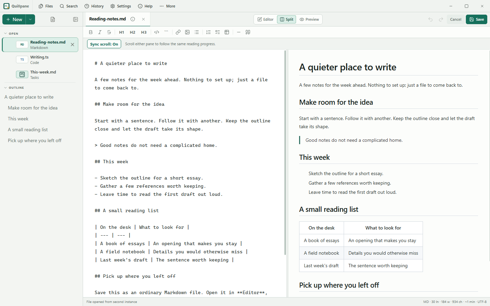

# Quillpane

Migration: Quillpane and Markpad are one application. Use **Quillpane (formerly
Markpad)** publicly; the `markpad` APT package, executable, repository and data
paths remain compatible. Maintain one Store listing and one update stream.

Quillpane (formerly Markpad) is a tiny native Markdown notepad and local file viewer. Opens fast, saves your work, gets out of the way.

No Electron. No cloud. One small binary, pure local and offline.

Project site: <https://quillpane.shreyam1008.com.np/>

All install links and store status: [Quillpane distribution tracker](https://shreyam1008.com.np/projects/#distribution-markpad). The GitHub installer is the default Linux path; signed APT, Scoop and [Microsoft Store](https://apps.microsoft.com/detail/9MZDJLQ6V8L3) are also available. Snap candidates are attached to GitHub releases; Snap Store and Flathub are not published yet.



## Install

### Linux (one command)

```sh
curl -sL https://raw.githubusercontent.com/shreyam1008/markpad/main/install.sh | sh
```

This downloads the binary to `/usr/local/bin/markpad`, adds a desktop entry, and installs the icon. After that: type `markpad` in terminal or find it in your app launcher.

Or grab a package from [Releases](https://github.com/shreyam1008/markpad/releases):

| Format | How |
|--------|-----|
| `.deb` | `sudo dpkg -i markpad_*.deb` |
| `AppImage` | `chmod +x Markpad.AppImage && ./Markpad.AppImage` |

### Windows

Download the installer from [Releases](https://github.com/shreyam1008/markpad/releases) → `markpad-setup.exe`. Run it. Quillpane appears in Start Menu and Desktop; the installer filename remains `markpad-setup.exe` for compatibility.

### Scoop (personal bucket)

```powershell
scoop bucket add shreyam https://github.com/shreyam1008/scoop-bucket
scoop install shreyam/quillpane
```

The official WinGet update is under review; it is not advertised as available until Microsoft publishes it.

### macOS

Download `Markpad.dmg` from [Releases](https://github.com/shreyam1008/markpad/releases). Open, drag to Applications. The app displays as Quillpane while the legacy artifact name remains stable.

### Build from source

```sh
# Prerequisites: Go 1.24+ and Bun

# Linux: also install WebKit2GTK
sudo apt-get install libgtk-3-dev libwebkit2gtk-4.1-dev

make setup
make build
./dist/markpad
```

The release binary embeds the compiled frontend. Node and node_modules are not required at runtime.

## What It Does

- **Guided tour** — Help → Tour walks through 16 steps using bundled Driver.js
- **Synchronized Split** — Editor and preview follow the same reading progress, with an off switch
- **File symbols and colors** — Distinct icons, extensions, and theme-aware colors identify file families
- **Single instance** — Only one window. Opening another file adds it to the existing window
- **Fast file switching** — `Ctrl+P` fuzzy-searches open files and actions
- **Explicit file actions** — Open and save individual notes; permanent saved-file deletion warns before removing the file and any unsaved edits
- **Safe shared-file editing** — Saving pauses if another app changed, replaced, or deleted the source; reload preserves the Quillpane draft in history
- **Open anything** — Markdown, text, code, config, logs, PDFs, images, ebooks, office docs, archives
- **PDF handoff** — PDFs open in the operating system's default viewer without bundling a PDF engine
- **Image preview** — Inline image display for PNG, JPG, GIF, WebP, BMP, etc.
- **Relative Markdown images** — Saved notes resolve local image paths beside the `.md` file through a bounded native reader
- **File verticals** — Markdown gets Editor/Split/Preview, code gets Edit/Code View, plain text opens in Editor, PDFs use the OS viewer, images show inline, others get info cards
- **Real code editing** — CodeMirror provides incremental language-aware editing, line numbers, bracket matching, and bounded undo history
- **Responsive source viewers** — Markdown and plain text wrap safely; long code lines stay inside their own local scroll region
- **Split view** — Editor, side-by-side split, or preview. `Ctrl+Shift+E` to cycle
- **Version history** — Every save is a snapshot. Click any entry for a unified diff. Restore or go back. `Ctrl+H`
- **Session restore** — Close and reopen. Every note, draft, favorite, recently opened file comes back
- **Sidebar** — Favorites / Open / Recent sections. Star on left, close on right. Collapse sections, drag-and-drop reorder
- **Sidebar Outline** — Real-time markdown Table of Contents outline that scroll-syncs the editor and viewer panes
- **Rich right-click** — Star, File Info, Open Folder, Copy Path, Close, Delete
- **File info** — Click (i) in the title bar for name, path, size, type, modified date, and Open Folder
- **Formatting toolbar** — Bold, italic, headings, code, links, images, lists, tables, blockquotes
- **Auto-list continuation** — Enter continues bullets, numbered lists, task lists. Empty prefix ends the list
- **Find** — `Ctrl+F` with wrap-around
- **Autosaved drafts** — Unsaved work survives app close
- **Status bar** — File type, line/word/char counts, reading time, encoding
- **In-app changelog** — Help > Changelog shows version history
- **Themes and settings** — Light, dark, system, five color themes, interface scale, reduced motion, and a single keyboard catalog

## File Handling

Quillpane stays lightweight by treating file families differently:

| Family | Behavior |
|--------|----------|
| Markdown | Editor, Split, Preview, formatting toolbar |
| Code/config | Fast plain editor plus syntax-highlighted Code View |
| Text/logs | Direct editor, simple stats |
| PDF | Read-only handoff to the operating system PDF viewer |
| Image | Inline preview with Open Externally button |
| Ebook/office/archive | Read-only info card with Open Externally |

Quillpane does not bundle or download a PDF engine. Images are read locally through Go and displayed as base64 data URLs.

## Versions

| Version | Name | Highlights |
|---------|------|------------|
| 0.13.8 | A clearer home | Unified Help with version badges, updates, local data location, and project/creator links |
| 0.13.6 | Refinements | Detailed tour, synchronized Split scroll, file-type symbols, syntax fixes, and removal of folder workspaces |
| 0.13.5 | Help & updates | Visible Help and Settings updates, verified installer downloads, synchronized release packages, original icon everywhere |
| 0.13.4 | Preview clipboard hotfix | Native preview copying; Help update checks and guided downloads |
| 0.13.3 | Quillpane (formerly Markpad) | Public-name migration with the verified Quillpane domain canonical; Markpad executable, storage, package IDs, release URLs, and logo preserved |
| 0.13.2 | Quillpane (formerly Markpad) | Clean native Linux chrome without the duplicate GTK menu, with a subtle window edge and sharper controls |
| 0.13.1 | Quillpane (formerly Markpad) | WebKitGTK-safe production bundle and native rendered-window release smoke test |
| 0.13.0 | | Incremental CodeMirror editor, lazy language modes, bounded relative Markdown images, prose wrapping, exact wrapped-note navigation |
| 0.12.0 | | Responsive code/text viewers, keyboard settings, interface scale, dark-theme contrast, fresh screenshots |
| 0.11.0 | | Strict design system, custom window chrome, stable overlays, modern Markdown/Mermaid, Git-style history diffs, unified assets |
| 0.10.0 | | React + strict TypeScript frontend, command palette, Workspace Lite folder navigation/search, confirmed saved-file deletion |
| 0.9.0 | | Packaging and distribution groundwork |
| 0.8.0 | Falguni | Real-time Sidebar Outline (Table of Contents), memory optimizations (disabled JIT, tuned GCPercent), sidebar transitions, welcome draft close bypass |
| 0.7.0 | Eklavya | Scroll position memory, extended syntax highlighting, performance, Open Folder fix, BUNDLE_BUDGET.md |
| 0.6.0 | Dhruva | Single instance, PDF rendering, image preview, file info, rich context menu, changelog |
| 0.5.0 | Chitrakala | File verticals, read-only cards, collapsible sidebar, preferences |
| 0.4.0 | Balram | Drag-and-drop file open, per-type view modes, expanded file icons |
| 0.3.0 | Aaradhya | Split view, formatting toolbar, drag reorder, syntax highlighting |
| 0.2.0 | | Version history, find, zoom, menus |
| 0.1.0 | | Initial release |

## Roadmap

The [public feature roadmap](docs/feature-roadmap.md) is organized as Now / Next / Explore, with each active card backed by a GitHub issue. The v0.14 milestone focuses on distraction-free writing and recovering meaningful bundle headroom. Split scroll sync shipped in 0.13.6. Folder-based roadmap ideas need reconsideration following removal of that feature.

See the live cards in [GitHub Issues](https://github.com/shreyam1008/markpad/issues) or the compact checklist in [TODO.md](TODO.md).

## Philosophy

Quillpane exists because many "lightweight" editors ship a browser engine. This one uses your OS's built-in webview and keeps release binaries around 16 MiB or less. There's no telemetry, account, sync service, or runtime dependency download. Just local files and a notepad.

## Keyboard Shortcuts

| Shortcut | Action |
|----------|--------|
| `Ctrl+N` | New note |
| `Ctrl+O` | Open file |
| `Ctrl+S` | Save |
| `Ctrl+Shift+S` | Save As |
| `Ctrl+Shift+E` | Cycle view |
| `Ctrl+Shift+B` | Toggle sidebar |
| `Ctrl+=` / `Ctrl+-` / `Ctrl+0` | Interface scale up / down / reset |
| `Ctrl+scroll` | Interface scale up / down |
| `Ctrl+H` | Version history |
| `Ctrl+F` | Find |
| `Ctrl+P` | Find files and actions |
| `Ctrl+B/I/K` | Bold / Italic / Link |
| `Ctrl+Del` | Delete current file or draft (with confirmation) |
| `Esc` | Close panel |

## Storage

All data is local:

| Platform | Path |
|----------|------|
| Linux | `~/.config/markpad/` |
| macOS | `~/Library/Application Support/markpad/` |
| Windows | `%AppData%\markpad\` |

```
session.json    # notes, favorites, recents, active state
drafts/         # autosaved draft files
history/        # version snapshots (max 50 per note)
```

## Contributing

```sh
git clone https://github.com/shreyam1008/markpad.git
cd markpad
make setup
make run
```

- Go backend in `app.go` and `internal/session/`
- Frontend in `frontend/` - React, strict TypeScript, Tailwind CSS, and Bun
- Full checks: `make check`
- Canonical Go tests: `go test -tags production,webkit2_41 . ./internal/... ./tests`
- Format: `gofmt -w .`

PRs welcome. Keep it simple, keep it fast.

## Tech Stack

Go · Wails v2 · React · TypeScript · Tailwind CSS · Bun · Marked · highlight.js · DOMPurify · Lucide

## License

MIT. See [LICENSE](LICENSE).
