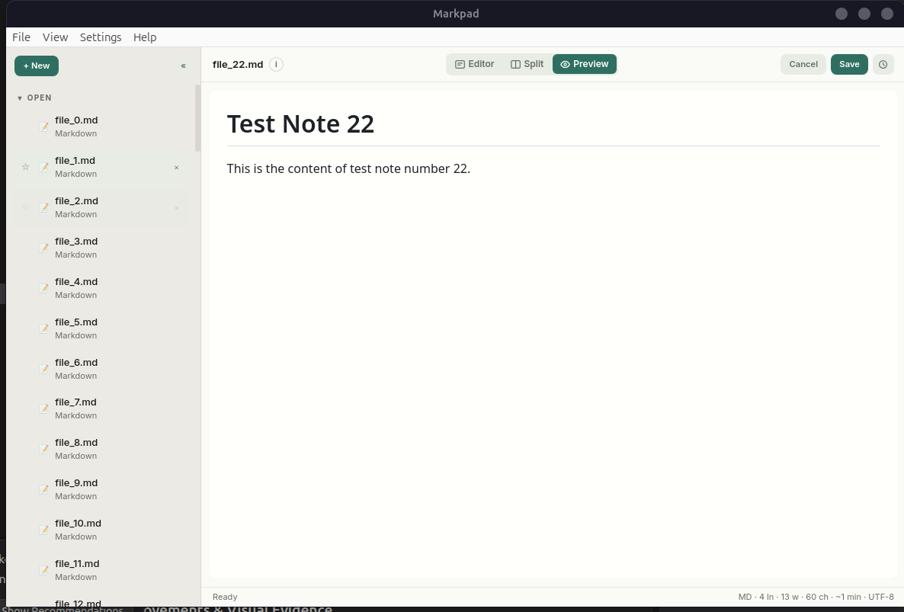

# Markpad

A small native Markdown notepad and local-file viewer. Markpad uses Go, Wails, and your operating system's webview—no Electron, account, sync service, telemetry, or runtime cloud backend.

> **Rebrand exploration:** Quillpane was implemented as a reversible display-name preview and is now on hold while Draftpane and Bractnote are screened. The product continues to display Markpad until a successor is explicitly approved and reserved. The `markpad` command, repository URL, package identifiers, config directory, browser-storage keys, and single-instance identity remain unchanged. See [the migration record](docs/rebrand-quillpane.md).



## Install

Download the current Markpad-named packages from [GitHub Releases](https://github.com/shreyam1008/markpad/releases). The package and command names do not change in this preview.

### Linux

```sh
curl -sL https://raw.githubusercontent.com/shreyam1008/markpad/main/install.sh | sh
```

Alternatively, use the `.deb` or the x86-64 binary from the release page. The raw binary requires GTK 3 and WebKitGTK 4.1 at runtime; the `.deb` declares those dependencies for Debian-based systems.

### Windows

Download `markpad-setup.exe` and run the NSIS installer.

### macOS

Download the DMG, or use the zipped `.app` fallback when provided.

## What it does

- Opens Markdown, text, source, config, and log files with a 10 MiB editable-file limit.
- Provides Editor, Split, and sanitized Preview views for Markdown.
- Provides Editor and syntax-highlighted Code View for text-based source files.
- Displays supported images locally and hands PDFs and other document formats to the system viewer.
- Autosaves recovery drafts and restores open files, favorites, recents, views, cursor, and scroll positions.
- Creates bounded local history snapshots around save, Save As, open, and restore operations.
- Includes native menus, file dialogs, drag and drop, single-instance file opening, a command palette, and keyboard navigation.
- Keeps normal note content local and works without downloading runtime dependencies.

## File handling

| Family | Behavior |
|---|---|
| Markdown | Editor, Split, Preview, formatting toolbar, outline |
| Code/config | Plain editor plus bounded syntax-highlighted Code View |
| Text/logs | Plain editor and viewer with document statistics |
| Images | Read-only inline preview, up to 50 MiB |
| PDFs | Read-only handoff card; opens in the system PDF viewer |
| Ebook/office/archive | Read-only information card and Open Externally action |

Markpad is intentionally a notepad, not a vault or knowledge-management platform. It is a good fit for private writing, scratch notes, and light source/config inspection. It is not designed for collaboration, synchronization, rich databases, or very large-file editing.

## Build from source

Prerequisites:

- Go 1.24 or newer
- Bun 1.3 or newer
- Wails CLI 2.12
- ripgrep for local quality and asset-policy checks
- GTK 3 and WebKitGTK 4.1 development packages on Linux

On Debian or Ubuntu:

```sh
sudo apt-get install gcc pkg-config libgtk-3-dev libwebkit2gtk-4.1-dev ripgrep
go install github.com/wailsapp/wails/v2/cmd/wails@v2.12.0
```

Then:

```sh
make setup
make check
make build
./dist/markpad README.md
```

For live development, run `wails dev`; `wails.json` supplies the Linux WebKitGTK 4.1 build tag. Bun bundles `frontend/dist`; production Go builds embed that generated directory. A clean non-production `make test` does not require generated frontend assets.

## Architecture

Markpad has three small boundaries:

- `main.go` and `app.go`: Wails lifecycle, native UI integration, filesystem operations, and frontend bindings.
- `internal/session`: testable session, draft, recent, favorite, and history persistence with atomic replacement.
- `frontend`: a small typed DOM entry plus the established imperative controller, bundled locally with Bun.

The temporary React wrapper has been removed. The remaining controller is being made testable incrementally; a wholesale UI rewrite is deliberately outside the stabilization scope.

See [docs/architecture.md](docs/architecture.md), [docs/behavior.md](docs/behavior.md), and [BUNDLE_BUDGET.md](BUNDLE_BUDGET.md) for the maintained contracts.

## Data safety and storage

All application data is below the platform user-config directory:

| Platform | Typical path |
|---|---|
| Linux | `~/.config/markpad/` |
| macOS | `~/Library/Application Support/markpad/` |
| Windows | `%AppData%\markpad\` |

```text
session.json              open documents and UI state
session.corrupt-*.json    preserved unreadable sessions
drafts/                   recovery content
history/                  up to 50 snapshots per document
```

Session, draft, snapshot, and saved-file writes use temporary-file replacement. A failed Save As does not adopt the new path in memory, and restoring history protects the immediate pre-restore draft first.

## Keyboard shortcuts

| Shortcut | Action |
|---|---|
| `Ctrl+N` | New note |
| `Ctrl+O` | Open file |
| `Ctrl+S` | Save |
| `Ctrl+Shift+S` | Save As |
| `Ctrl+P` | Command palette |
| `Ctrl+Tab` / `Ctrl+Shift+Tab` | Next / previous open file |
| `Ctrl+1` / `Ctrl+2` / `Ctrl+3` | Editor / Split / Preview when available |
| `Ctrl+Shift+E` | Cycle available views |
| `Ctrl+Shift+B` | Toggle sidebar |
| `Ctrl+H` | Version history |
| `Ctrl+F` | Find |
| `Ctrl+B` / `Ctrl+I` / `Ctrl+K` | Bold / italic / link |
| `F2` | Rename saved file |
| `Ctrl+W` | Close current file |
| `Ctrl+Del` | Delete an unsaved draft |

On macOS, standard Command equivalents are used where supported by Wails and the frontend.

## Quality gates

`make check` runs the complete Go suite and frontend tests, TypeScript, lint, formatting, offline-asset policy, production bundle, and frontend-size checks. Release CI additionally runs the Go race detector and vet before cross-platform packaging.

Production outputs have explicit size ceilings instead of undocumented “instant” or memory claims. Repeatable startup, typing-latency, and total-PSS benchmarks remain future work.

## Repository scope

The root application is the only Markpad product built and released by this repository. The tracked `ports/shreyamnotes-wails` experiment is excluded from root CI and release artifacts; if its development continues, it should be moved to its own repository rather than merged into Markpad's small product scope.

## Tech stack

Go 1.24+ · Wails 2.12 · TypeScript · Bun · Tailwind CSS · Marked · DOMPurify · highlight.js core

## License

MIT. See [LICENSE](LICENSE).
