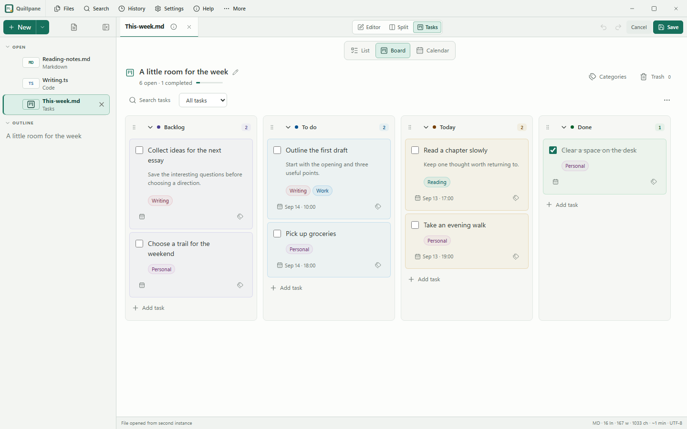
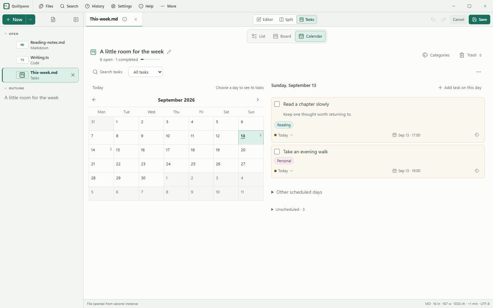

# A two-minute look at Quillpane

Quillpane is a local Markdown notepad first. Task planning is there when a note
needs a few next steps. These samples contain only demonstration content.

1. Download [Reading-notes.md](examples/Reading-notes.md) and open it in Quillpane.
   Switch from Preview to Split, edit a sentence and watch the preview follow.
2. Save the note, make a second edit and open History to compare versions.
3. Open [This-week.md](examples/This-week.md). It is an ordinary Markdown file
   with a task marker. The dates deliberately match the September 2026 captures.
4. Try Board: move a task, collapse a category and select a tag pill. Dates stay
   in a fixed place. Right-click a card to see its actions.
5. Switch to Calendar and select September 13 or 14, 2026 to see the sample agenda.
   Use Ctrl+F to search tasks. Move a sample task to Trash and restore it.
6. Switch back to the note. Task planning has its own file; your writing stays writing.






The screenshots are genuine Quillpane 0.14.1 Windows WebView captures at 1440 × 900,
using the public samples above and a disposable app profile. Linux and macOS use
their system WebViews, so platform rendering can differ. No user files appear.

To reproduce them on Windows after building the frontend:

```powershell
python .github/scripts/build-performance-windows.py dist/performance/quillpane-product-capture.exe
bun .github/scripts/capture-product-windows.mjs dist/performance/quillpane-product-capture.exe dist/product-0141
```

The capture executable is instrumented for local inspection and must never be
distributed. The normal release uses the same UI without that instrumentation.

Next on the [roadmap](feature-roadmap.md): an optional infinite canvas board for
local ideas and note references. It is not included in this release.
