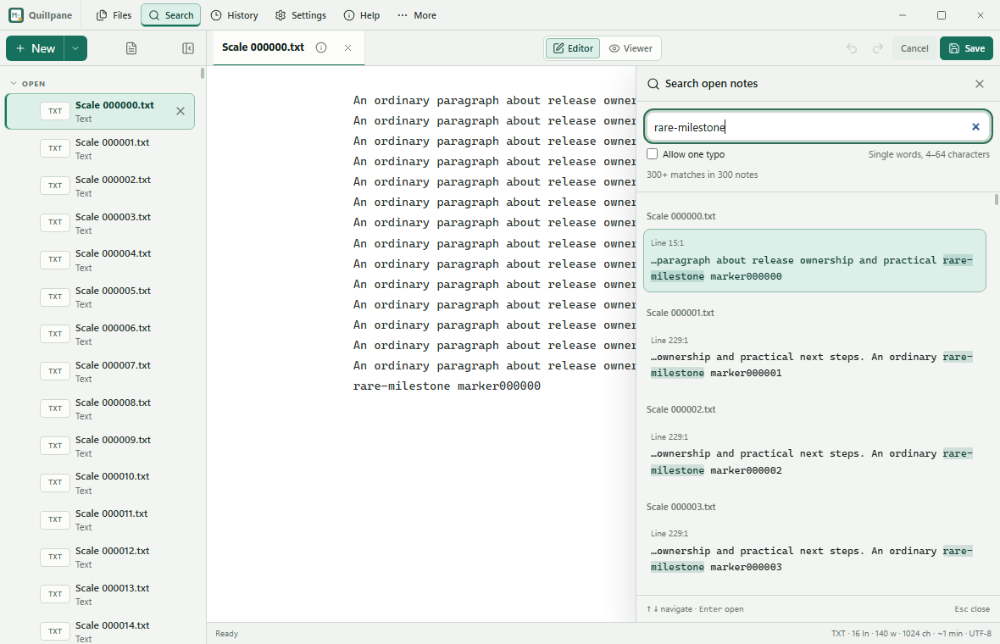

# Content search scaling experiment

This experiment measures Quillpane's open-note search from one small note to
1,000 notes and a 16 Mi UTF-16-unit snapshot. It compares complete search work,
source highlights, native snapshot transfer, CPU work and memory. It does not
rank tools for arbitrary Linux disk searches. Production search has no added
dependency, persistent index, subprocess or runtime service.



## Implementation

Exact matching uses the existing WebView's case-insensitive Unicode literal
regular expression. Source positions refer to the original UTF-16 string, so
case folding does not shift highlights or editor selections. Locations are
computed only when a result needs them. Exact scans use 32 Ki-unit windows;
optional one-typo scans use 4 Ki-unit windows with an allocation-light ASCII
tokenizer and the original Unicode word tokenizer where needed. Both preserve
word/chunk boundaries and yield after approximately 8 ms. Typo tolerance accepts
one insertion, deletion, substitution or adjacent swap in a 4–64-character word.

The active buffer comes directly from the editor. Inactive recovery/source text
crosses the native bridge in pages of at most 1 Mi UTF-16 units and 128 examined
IDs. A large accepted note spans multiple pages. Each whole note must fit the
remaining 16 Mi-unit scope budget before its first fragment is admitted. Its
fragments are joined once, and searched only after completion. A changed
source path, size or modification timestamp invalidates that partial note.
The stamp cannot detect external replacements that preserve all three fields;
result selection rechecks the current matched text before navigation.
Source offsets use UTF-8 bytes in the native continuation and UTF-16 units in
the renderer; no rune is split during transfer. Search does not repair drafts,
write files or update saved-source fingerprints.

An oversized note is omitted explicitly, and later smaller notes still qualify.
The 32 Mi workload measures that bounded partial scope, not a full 32 Mi scan.
Queries are limited to 256 UTF-16 units and visible results to 300; dense searches
can stop early. Full scans are demonstrated by absent queries and a marker in
the 1,000th note. Highlights include the full searched span, including long
literal and astral-character matches.

## Native measurements

The tables below are generated from the committed sanitized evidence
in `search-scalability-evidence.json`. Raw synthetic profiles remain in ignored
`dist/performance`; the reproducible profiler is committed separately.

Warm absent queries scan every accepted note. Times are milliseconds; the
second value is p95. `Before` is the existing search at `de8e99b`; `after` is
the measured bounded implementation, identified by source hashes in the evidence.

| Scope | Exact before → after, median/p95 | One-typo miss before → after, median/p95 |
|---|---:|---:|
| One small note | <0.1 → <0.1 | <0.1 → <0.1 |
| 20 × 32 Ki units | 1.1/1.3 → 0.1/0.1 | 4.0/5.2 → 3.0/4.9 |
| 100 × 1 Ki units | 0.2/0.2 → <0.1/0.1 | 0.7/0.9 → 0.4/1.1 |
| 1,000 × 1 Ki units | 1.7/2.0 → 0.3/0.4 | 6.2/10.2 → 4.3/7.3 |
| 8 Mi units | 15.6/19.6 → 1.2/1.4 | 99.6/116.1 → 60.8/69.4 |
| 16 Mi units | 30.9/41.9 → 2.7/3.7 | 173.3/186.2 → 126.7/131.8 |
| 16 Mi units, many JSON escapes | 39.1/52.1 → 4.3/6.8 | 171.6/199.6 → 131.3/140.2 |
| 16 Mi units, varied Unicode/tab/line text | 41.1/44.0 → 2.9/3.6 | 165.6/174.7 → 97.5/107.4 |

The actual panel adds an 80 ms debounce and native snapshot loading. These
whole-app memory figures include the editor, sidebar, Go host and owned WebView
processes, rather than an isolated search allocation.

| Scope | Cold snapshot before → after | Reopen median before → after | One-typo input-to-results before → after | Sampled whole-app private maximum, MiB before → after |
|---|---:|---:|---:|---:|
| One small note | 20.3 → 21.4 | 7.8 → 5.3 | 85.6 → 82.3 | 179 → 179 |
| 20 × 32 Ki units | 78.8 → 42.6 | 51.1 → 36.7 | 92.6 → 88.2 | 213 → 214 |
| 100 × 1 Ki units | 100.4 → 33.1 | 68.9 → 26.5 | 86.3 → 83.6 | 225 → 219 |
| 1,000 × 1 Ki units | 430.8 → 227.6 | 440.4 → 187.3 | 98.2 → 104.1 | 434 → 447 |
| 8 Mi units | 253.7 → 266.0 | 364.2 → 266.6 | 164.0 → 131.8 | 258 → 266 |
| 16 Mi units | 517.3 → 531.5 | 514.5 → 516.6 | 246.4 → 200.5 | 298 → 295 |
| 16 Mi units, escaped text | 830.7 → 628.9 | 777.1 → 655.6 | 246.7 → 195.9 | 331 → 332 |
| 16 Mi units, varied text | 543.5 → 529.4 | 595.4 → 649.2 | 209.3 → 171.7 | 296 → 294 |
| 32 Mi units, explicit partial scope | 501.2 → 630.1 | 763.3 → 562.6 | 256.6 → 178.9 | 298 → 292 |
| Oversized 20 Mi-unit draft, later small note | 756.6 → 39.8 | 616.5 → 36.6 | 82.5 → 85.6 | 483 → 184 |

Loading is not uniformly faster. A later focused 1,000-note run took 1,407 ms
cold, with five reopens of 459, 509, 259, 146 and 1,396 ms; its median was
459 ms versus the baseline's 440 ms. A focused plain 16 Mi run had a 626 ms
reopen median versus 515 ms before. These outliers stay in the evidence.
The selected 1 Mi-unit pages removed the observed large bridge decode LongTasks
without materially increasing the sampled 16 Mi memory maximum. A single large
packet and 256 Ki-unit pages were rejected: respectively they caused a 153–201 ms
decode stall or increased the sampled memory maximum to about 360 MiB.

In separate V8 CPU profiles, the large fuzzy miss attributed about 155 → 132 ms
to non-idle samples; the 1,000-small-note snapshot about 223 → 98 ms. These are
sampled stack-time estimates, not precise total CPU. The evidence also retains
bracketed owned-WebView OS CPU counters and whole-tree CPU sampling windows.

All 45 helper timing cases and 11 native workload checks passed their source
highlight/selection oracles. A separate accepted 2 MiB inactive text note
verified paging and exact Unicode/CRLF selections. That navigation test exposed
two editor limits: opening tab-rich text already creates expensive native
textarea layout, and the result reveal incorrectly assumed soft wrapping for
plain text. The latter is corrected separately and measured below.

The combined 1,000-note / 16 Mi-unit run also searched a unique marker in the
last note and selected its exact source text. Cold snapshot loading fell from
3,838 to 626 ms. Five reopen times were 3,823 / 3,792 / 4,213 / 3,555 / 4,741 ms
before, and 588 / 600 / 608 / 578 / 585 ms after: medians 3,823 → 588 ms.
The observed 63 ms initial LongTask disappeared and the maximum scoped timer gap
fell from 86.6 to 24.8 ms. Sampled whole-run private memory was 569 → 529 MiB,
including the existing 1,000-row sidebar and later result navigation.

Plain-text result navigation now counts hard lines for vertical position and
measures only the current hard-line prefix for horizontal position. It selects
and reveals the source rather than soft-wrapping a hidden copy of the whole
preceding document. Normal wrapped Markdown keeps its existing geometry; very
large wrapped editor layout is not made bounded by this search change.

Final-source checks revealed the deep exact match and column 65,508 in plain
text, and a distant wrapped Markdown match in a narrow window. The accepted
2 Mi-unit recovery snapshot/query scope sampled at most 221 MiB private memory;
the later large native editor activation brought the whole scenario to 935 MiB.
Ordinary activation alone incurred a 902 ms layout LongTask. Actual Ctrl+F on
that already-open note preserved query focus and revealed the exact selection,
but still took about 99 ms including controller/polling, with a 61 ms layout
LongTask and a 98 ms timer gap. The native control remains expensive; the earlier
low-cost geometry-only prototype is not substituted for this final measurement.

The separate 1 Mi-unit worst JSON-escaping recovery took 191 ms cold, with
183 / 167 ms reopens, a sampled private maximum of 224 MiB, no scoped LongTasks
and a 49 ms maximum timer gap. These boundary checks are retained separately
from ordinary saved-note measurements.

The measured Windows production executable is version 0.14.4, 18,908,672 bytes.
Embedded assets total 6,792,528 bytes: 6,632,453 JavaScript and 158,098 CSS bytes,
including the existing lazy diagram bundle. SHA-256 identities and per-asset
raw/gzip sizes are in the evidence. These measurements precede the final commit;
exact-commit Windows smoke, binary identity and Ubuntu CI results are recorded
in [PR 18](https://github.com/shreyam1008/markpad/pull/18).

## Existing solutions

The comparison installs exact tool versions only in ignored diagnostic scratch.
No package was added to the application or its lockfile. These measurements use
Windows Node/V8, separate synthetic corpora and source mapping where applicable;
they must not be mixed with the native table above.

| Solution | What the experiment established | Decision for open buffers |
|---|---|---|
| [ripgrep 15.2](https://github.com/BurntSushi/ripgrep) | A 16 Mi-unit exact miss over stdin took about 53 ms, sparse matches 87 ms including launch, transport and source mapping. Preparing the UTF-8 buffer took about 47 ms and retained another 16 MiB external buffer. Subprocess CPU/peak memory was not measured. | Excellent file/regex tool, but the process and encoding boundary costs more than the selected in-buffer scan here. |
| [Go stdlib regexp](https://pkg.go.dev/regexp) | The tested resident worker took about 194 ms for an exact miss, 313 ms for sparse results, 216 ms to load and 26 ms to replace one large note. It retained about 16.4 MiB Go heap. | This implementation added copies/transport without improving the workload. These numbers do not establish Go's maximum performance. |
| [uFuzzy 1.0.19](https://github.com/leeoniya/uFuzzy) | Whole-note filtering took about 344 ms on the large miss; a separate 1 ms timer probe was approximately 393 ms late, including scheduler jitter. Bounded filtering took 688 ms; source verification and occurrence mapping still apply. | The allocation-light bounded tokenizer was faster and cancellable. |
| [Fuse 7.5.0](https://www.fusejs.io/fuzzy-search.html) | Raw match offsets shifted after an `İ` case-fold expansion in the tested source. | Needs an additional source offset map/verifier; not a drop-in occurrence highlighter. |
| [MiniSearch 7.2.0](https://lucaong.github.io/minisearch/) | Large-corpus index build took about 1.25 s, one 2 Mi-unit update 152 ms, with about 77.7 MiB additional JS index heap. Interior substrings and one adjacent swap do not match the required contract. | Fast indexed token lookup does not replace this literal/one-typo occurrence search. |
| [FlexSearch 0.8.212](https://github.com/nextapps-de/flexsearch), [ugrep](https://github.com/Genivia/ugrep), [fzf](https://github.com/junegunn/fzf) | Assessed for indexing, file-search and input-item selection semantics; not performance-benchmarked. | Each needs adaptation for unsaved buffers, exact source occurrences and this typo contract. No speed ranking is claimed. |

The selected 4 Ki-window diagnostic variant's synthetic Node/V8 fuzzy miss fell from 30.85 to 4.60 ms
for 20 × 32 Ki-unit notes, 905 to 194 ms for eight notes totaling 16 Mi units,
and 900 to 173 ms for 1,000 notes totaling 16 Mi units. In the first large case,
measured JS CPU fell from approximately 631 to 84 ms per query. Indexed-library
post-GC heap and process RSS snapshots are not peak whole-app memory measurements.
The final production helper was verified separately: a differential comparison
against the preserved helper passed 4,392 typo/chunk cases, plus long-word and
dense 64-character adversarial cases. Unit tests independently compare short
words with an edit-distance oracle. Its native measurements are in the table
above; the Node matrix was not
repeated after applying the diagnostic variant to production. Frozen source
identities and comparative measurements are in `search-tool-evidence.json`.

## Measurement limits and reproduction

Native timings use Windows Wails/WebView2, Edge 154.0.4258.48 and V8 15.4.11.6,
on an Intel Core Ultra 7 265K with eight visible logical CPUs, Go 1.27.1 and
Bun 1.4.2. Runs are sequential to avoid competing test/build load, with synthetic
disposable native sessions. Unrelated desktop load is not fully controlled.
Ordinary saved fixtures are at most 1 MiB each, below the 2 MiB editable-file
boundary; the accepted 2 MiB recovery boundary and anomalous oversized drafts
have separate checks.

Warm helper medians and p95s include matching, snippets, locations and yields,
but exclude native reads, the 80 ms debounce and layout. The actual panel uses
native shortcuts and trusted key input. Input-to-results includes debounce,
and two animation frames provide a presentation opportunity proxy, not a GPU
paint measurement. Values below the approximately 0.1 ms timer resolution are
reported as such, not as zero-cost work.

Renderer V8 heap is sampled every 50 ms. Owned app/WebView process-tree private
committed bytes are sampled every 200 ms; shared working sets are not summed.
Reported maxima are sampled maxima, not absolute allocation peaks. Natural
post-close and diagnostic forced-GC points stay separate; V8 GC does not force
Go GC. Five close/reopen cycles check short-term retention, not lifetime leaks.
Startup and expanded-sidebar allocations fluctuate; whole-app memory cannot
all be attributed to search. The independent 1,000-row sidebar diagnostic found
about 28 MiB of steady expanded-list private memory after re-expansion, outside
this search change.

CPU profiles use V8's 1,000 µs sampling interval in separate instrumented runs;
they exclude Go, GPU and waiting. Whole-tree cumulative process CPU complements
them where the 200 ms process samples span an operation. Missing samples are
reported as unavailable. Chromium's `ScriptDuration` counter undercounts async
continuations here and is not labeled total query CPU. Scoped LongTask entries
and 4 ms timer gaps describe responsiveness without including fixture setup.

Build the isolated diagnostic executable with
`.github/scripts/build-performance-windows.py`, then run:

```powershell
bun .github/scripts/profile-content-search-windows.mjs dist/performance/quillpane-search-profile.exe dist/performance/scaling-final
```

Use `--source=preserved-baseline.ts --snapshot-policy=stop-at-first-overflow
--highlight-policy=bounded` with the preserved baseline binary to reproduce old
behavior. `--only=small,standard20,many100,many1000,cap8,cap16,cap16escaped,varied16,over32,oversizedDraft`
selects workloads. Also use `--only=many1000medium,inactiveMultiPage,worstJsonRecovery,wrappedMarkdown,horizontalPlain`
for combined scaling, paging boundaries, escaping and result reveal checks.
Diagnostic instrumentation exists only in a private Wails
dependency copy and never ships in the production binary.

The comparative script `.github/scripts/compare-content-search.ts` documents
setup, exact dependencies, focused engines/fixtures, frozen source hashes,
resume checks and `--oracle`. Optional missing tools are labeled unavailable.
From a fresh clone, prepare the preserved baseline and run its differential
comparison against the current production helper:

```powershell
New-Item -ItemType Directory -Force dist/search-scaling-comparison
python -c "import pathlib,subprocess; pathlib.Path('dist/search-scaling-comparison/baseline.ts').write_bytes(subprocess.check_output(['git','show','de8e99b275328984456968251ecf7d8950eb3ec6:frontend/src/workspace/content-search.ts']))"
bun .github/scripts/compare-content-search.ts --setup
bun build .github/scripts/compare-content-search.ts --target=node --outfile=dist/search-scaling-comparison/compare.mjs
node --expose-gc dist/search-scaling-comparison/compare.mjs --oracle --reference-source=dist/search-scaling-comparison/baseline.ts
```

Git checkout line endings can change raw source byte hashes; compare normalized
source text as well as the recorded commit when reproducing on another platform.
Run the compiled script without `--oracle` for the comparison matrix, or append
`--engines=current --fixtures=20-normal,eight-large` for a focused scan. The
committed matrix measured the frozen diagnostic variant, while this command
measures the current production helper. `--resume` accepts only rows with matching
source, reference, harness and runtime/dependency identities.

Native performance measurements are Windows evidence. The Ubuntu CI GTK/WebKit
functional smoke verifies Linux search interactions, not equivalent Linux RAM,
CPU performance or every distribution. Source/build success and public release
state remain separate; no release or store publication belongs to this change.
