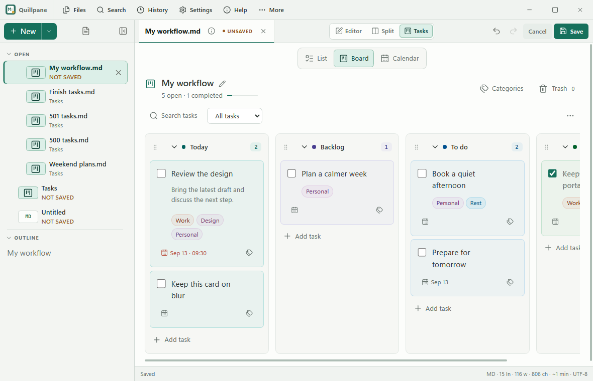
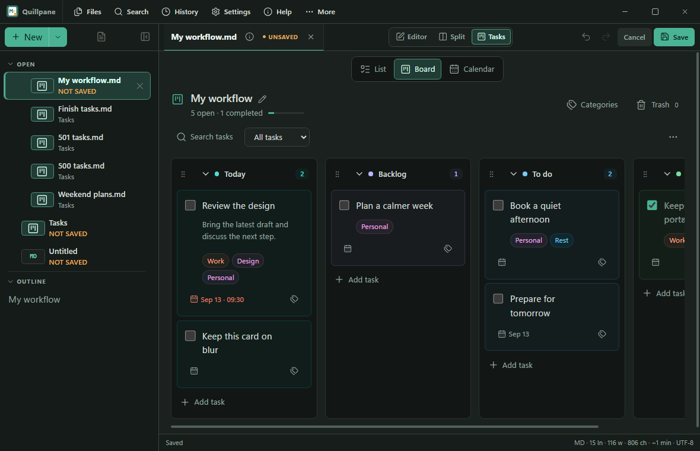
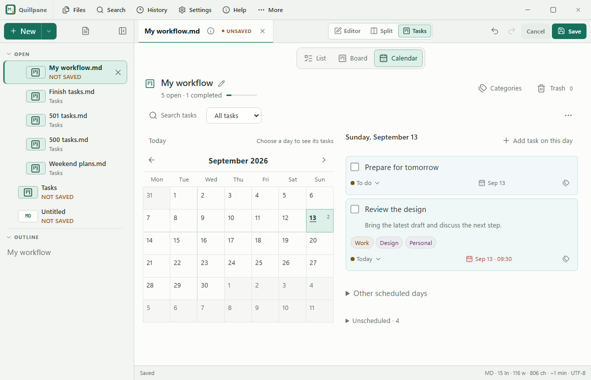
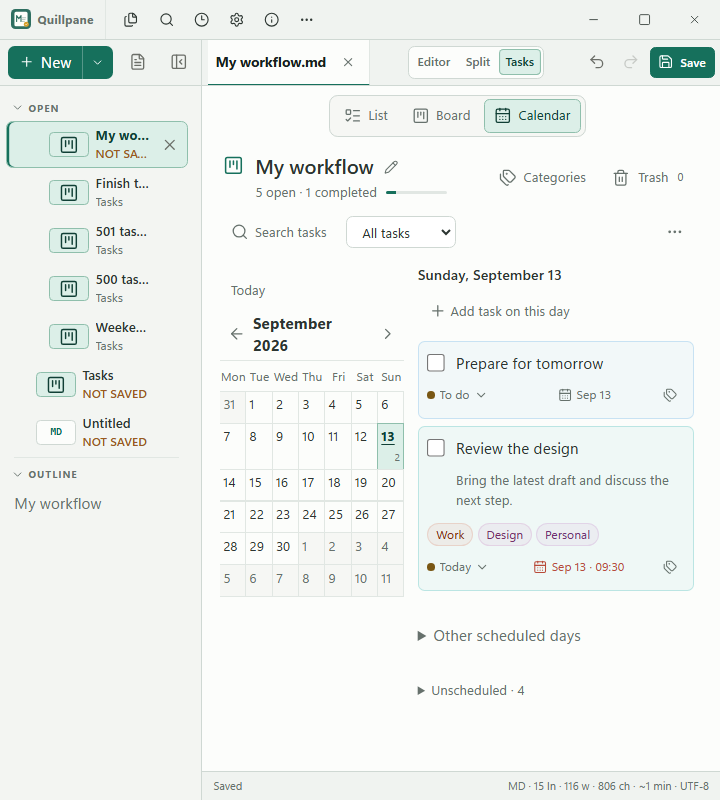
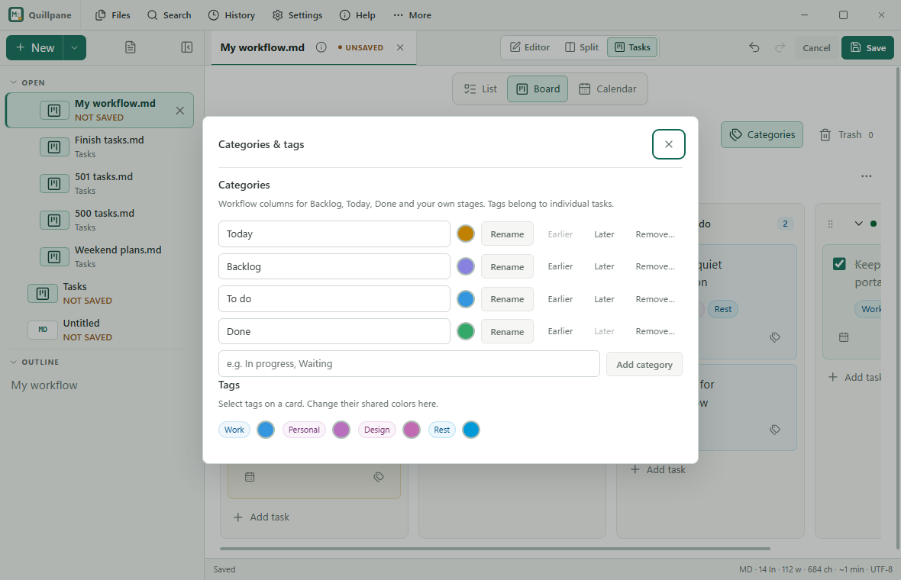
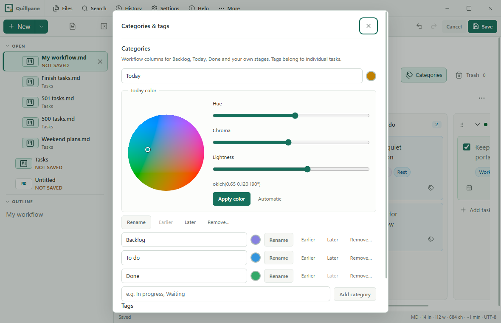
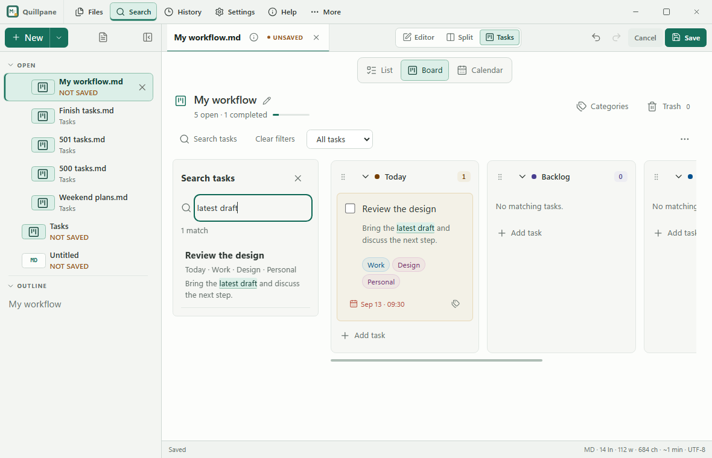
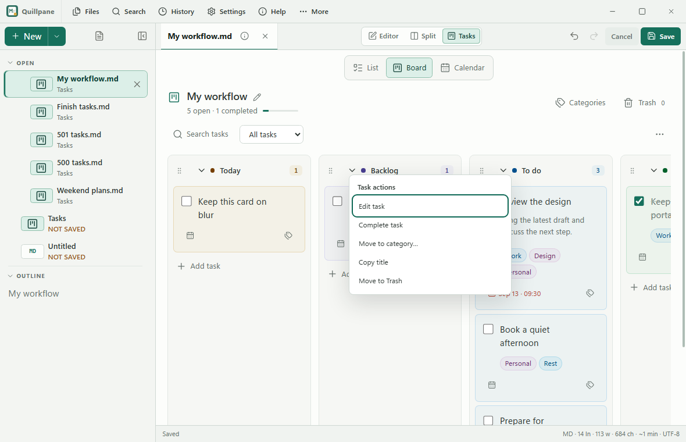

# Task planning 0.14.0: design and verification

A fresh native baseline and the running ZenNotes reference were inspected in
this pass. The implementation extends Quillpane's existing components and
single-file model without bundling the reference runtime or adding packages.

| Step | Result and verification |
|---|---|
| 1. Categories | Focused native dialog for naming, ordering, removal and colors |
| 2. Board labels | Repeated category selectors removed; drag/context movement retained |
| 3. Metadata | Date left, tag control right; fixed geometry and hover/focus actions |
| 4. Identity | Separate automatic category/tag colors, adapted for light and dark |
| 5. Calendar | Month left, selected-day agenda right; other dates and unscheduled tasks |
| 6. View tabs | Centered under Editor/Split/Tasks, verified in Board and Calendar |
| 7. Right-click | Edit, Complete/Reopen, Move, Copy title and Trash; keyboard context menu |
| 8. Task search | Active file titles, categories, tags and descriptions are searchable |
| 9. Card color | Subtle full-surface fill replaces the side stripe |
| 10. Density | Shown/total row removed; bulk cleanup moved to Board actions |
| 11. Color editing | OKLCH wheel and keyboard sliders; reset, persistence and rename tests |
| 12. Search sidebar | Highlighted results/cards; global Search routes to the task sidebar |

The visual review caught and corrected an inherited flex basis enlarging cards,
a calendar rule affecting the page root, and stretched color swatches. Source
tests cover invalid metadata, CRLF preservation, fenced examples, prototype-like
labels and category-color retention on rename. Screenshots and tests do not
establish full accessibility compliance.

## Verification

- **120 Windows native checks**, zero runtime errors.
- **93 frontend tests**, strict TypeScript, lint and formatting pass. Existing
  React Compiler warnings remain in older app/workspace components.
- Canonical Go tests and vet, frozen Bun installation, offline asset scan and
  version metadata checks pass. Both frontend targets build; the final local
  executable embeds Windows assets. Native Linux execution is a release CI gate.
- Existing recovery, bounded undo, atomic-save and external-change checks remain.

| Artifact | Bytes |
|---|---:|
| Stripped Windows executable | 18,835,456 |
| Windows initial JavaScript | 1,243,733 |
| Windows deferred diagrams | 5,365,297 |
| Windows CSS | 150,858 |
| Linux-target JavaScript | 6,592,500 |
| Linux-target CSS | 152,005 |

Windows executable: **17.96 MiB**. Instrumented first paint: **651 ms**. The
500-row fixture became ready in **242 ms** (100 ms polling resolution). After
forced JS GC, process-tree private committed memory measured 225.1 MiB after
the extended six-task workflow, 252.8 MiB for 500 List tasks and 298.9 MiB for
500 Board tasks. These are instrumented snapshots, not ordinary-note idle or
peak measurements; they do not prove lower RAM or a performance floor. Task
rendering remains bounded at 500 tasks including Trash and 200,000 characters.

Evidence: [native results](tasks-release-verification-2026-09.json).
Distribution status: [publication checklist](../packaging/PUBLICATION-TODO.md).
